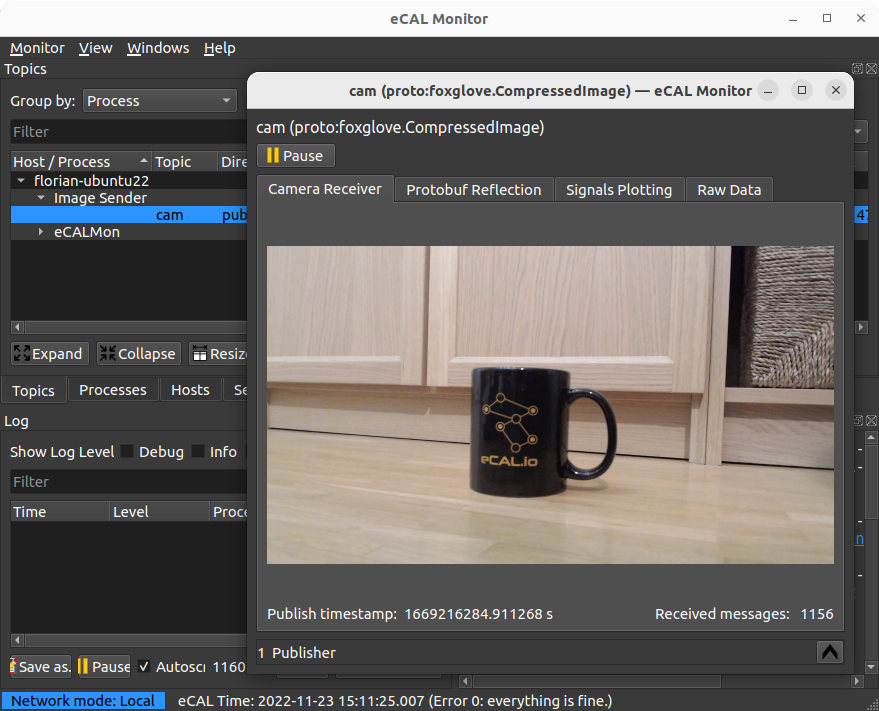

# ecal-camera-samples

The ecal-camera-samples is a set of projects around sending and receiving image data with [eCAL](https://eclipse-ecal.github.io/ecal/).

After installation, you have 2 components available:

1. A **sender application** `ecal_camera_snd` that publishes the data of a webcam device to an eCAL topic
2. A **monitor plugin** that can display the image data in the eCAL Monitor

# How to install prebuilt binaries

1. [Install eCAL](https://eclipse-ecal.github.io/ecal/getting_started/setup.html) (obviously 😉)
2. Go to the [release page](https://github.com/eclipse-ecal/ecal-camera-samples/releases) and pick the version matching your OS and eCAL Version

3. **Windows**: Copy the content of the zip archive to the bin directory of your eCAL Installation, probably at `C:\eCAL\bin\`

    **Ubuntu**: Install the dependencies and the downloaded .deb installer:

    ```bash
    sudo apt install ecal libqt5multimedia5-plugins
    sudo dpkg -i ecal-camera-samples*.deb
    ```

# How to build it yourself

## Windows

1. Install dependencies:
    - [eCAL](https://eclipse-ecal.github.io/ecal/getting_started/setup.html)
    - [Qt](https://www.qt.io/download) 5.15.2 `msvc2015_x64`
    - [CMake](https://cmake.org/)

2. Configure with CMake and build the Project
    ```bat
    mkdir _build
    cd _build
    cmake .. -DCMAKE_PREFIX_PATH=C:/Qt/5.15.2/msvc2015_64

    cmake --build . --config Release
    ```

## Ubuntu

1. Install dependencies:

    Add the eCAL PPA like described here: https://eclipse-ecal.github.io/ecal/getting_started/setup.html#fa-ubuntu-automatically-install-ecal-from-a-ppa

    ```bash
    sudo apt install ecal \
                     qtmultimedia5-dev \
                     libqt5multimedia5-plugins \
                     qtwayland5 \
                     protobuf-compiler \
                     libprotoc-dev \
                     libhdf5-dev \
                     cmake
    ```

2. Configure with CMake and compile

    ```bash
    mkdir _build
    cd _build
    cmake .. -DCMAKE_BUILD_TYPE=Release

    cmake --build .
    ```

# Usage

## eCAL Camera Sender

This application captures the stream from a specified camera and publishes it via eCAL. Optionally, the resolution of the image as well as a maximal framerate can be specified.

Usage:
```
ecal_camera_snd [topicName] [cameraName] [OPTIONAL_resolutionWidth] [OPTIONAL_resolutionHeight] [OPTIONAL_maxFps]
```

Command Line:
```
topicName:        Name of the eCAL Topic to publish to
cameraName:       Path to camera. Call --list-cameras to list
                  available cameras. 
resolutionWidth:  Image width (optional) 
resolutionHeight: Image height (optional) 
maxFps:           Maximal framerate (optional)

--help:           Print this help
--list-cameras:   List all available cameras
```

Example:
```bash
ecal_camera_snd compressed_image_protobuf /dev/video0 640 480 10
```

## eCAL Monitor Plugin

After running cmake --install on the monitor plugin, you can view the published camera image in the eCAL Monitor GUI in the detailed view under the Camera Receiver tab.

